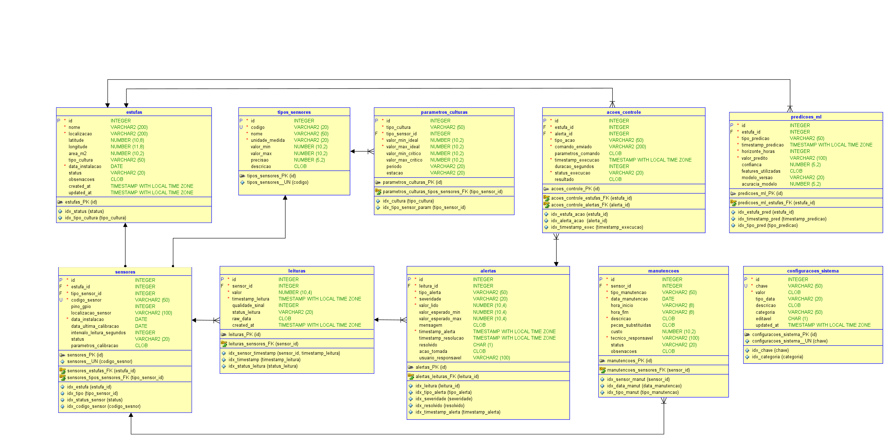
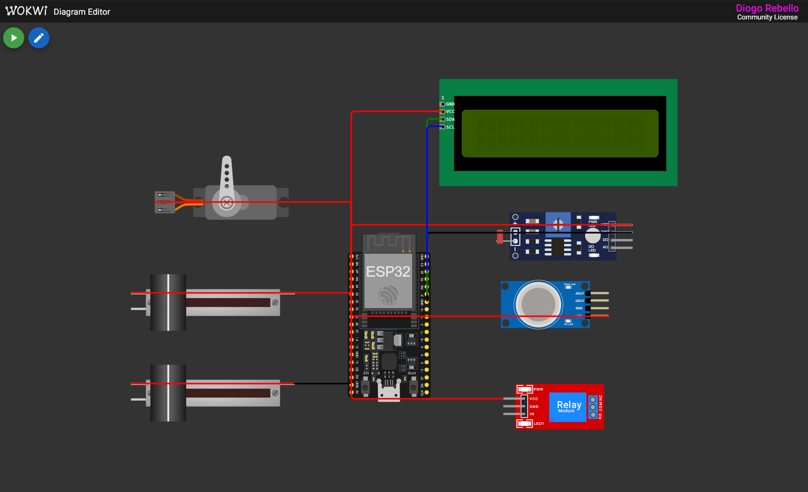
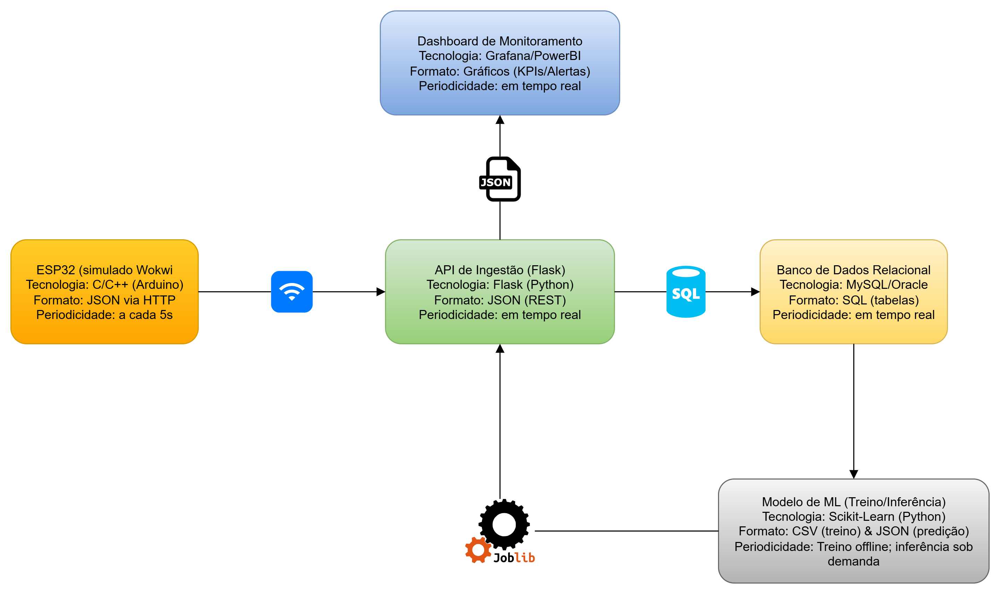

# FIAP - Faculdade de Informática e Administração Paulista 

<p align="center">
<a href= "https://www.fiap.com.br/"></a>
</p>

<br>

# 🌱 FASE 5 - ENTERPRISE CHALLENGE (SPRINT 4)

### ▶️ Vídeo de Evidência do Funcionamento do Projeto
👉 [Link do vídeo no YouTube (não listado)](https://youtube.com)

---

## 👨‍🎓 Integrantes
| Matrícula | Aluno                           |
|-----------|---------------------------------|
| RM 565497 | Vera Maria Chaves de Souza      |
| RM 565286 | Diogo Rebello dos Santos        |

## 👩‍🏫 Professores
- **Tutor(a):** Leonardo Ruiz Orabona  
- **Coordenador(a):** André Godoi Chiovato  

---

## 📜 Descrição

Estufa Inteligente com IoT, Banco de Dados, Machine Learning e Dashboard.

Este projeto integra:
- **IoT (ESP32 no Wokwi/PlatformIO)** para coleta de dados ambientais.
- **API em Flask** para ingestão e persistência dos dados.
- **Banco relacional (MySQL/Oracle/SQL Server)** para armazenamento.
- **Machine Learning (Scikit-Learn)** para previsão de irrigação.
- **Dashboard em Streamlit** para KPIs e alertas em tempo real.

Objetivo: simular uma solução **fim-a-fim** de Agricultura 4.0.

---

## 📁 Estrutura de Pastas

```
ENTERPRISE_FINAL/
│
├── assets/                  # Recursos visuais (diagramas, logos)
│
├── db/                      # Scripts SQL
│
├── docs/arquitetura/        # Documentação da arquitetura
│
├── ingest/                  # Camada de ingestão
│   ├── api/                 # API Flask
│   └── esp32/               # Simulação IoT no Wokwi
│
├── ml/                      # Machine Learning
│
├── dashboard/               # Visualização (Streamlit)
│
├── README.md                # Documentação principal
```

---

## ⚙️ 1. API (Flask)

### Como rodar:
```bash
cd ingest/api
python -m venv venv
source venv/bin/activate   # Linux/Mac
venv\Scripts\activate      # Windows
pip install --no-cache-dir -r requirements.txt
python app.py
```

👉 Acesse em: http://localhost:5000/apidocs

**Principais endpoints:**
- `POST /leituras` → Envia leituras do ESP32
- `GET /leituras` → Consulta últimas leituras
- `GET /status` → Status da irrigação

---

## ⚙️ 2. Banco de Dados

Scripts em `/db`.

### Modelo Relacional:



### Exemplo (MySQL):
```bash
mysql -u root -p < db/create_tables_mysql.sql
mysql -u root -p < db/insert_sample_data.sql
```

---

## ⚙️ 3. ESP32 + Wokwi



Na pasta `/ingest/esp32`.  
Inclui simulação com:
- 🌡️ DHT22 (Temp/Umidade do ar)  
- 🌱 CAPACITIVO (Umidade do solo)  
- 💡 LDR (Luminosidade)  
- 🌡️ LM35 (Temp do solo)  
- 🟢 MQ135 (Qualidade do ar / CO₂)  

---

## ⚙️ 4. Machine Learning

Tudo fica em `/ml`.

### 📦 Instalação
```bash
cd ml
pip install -r requirements.txt
```

### 🎓 Treino
```bash
python train_model.py
```

O script:
- Lê as leituras do MySQL (últimas 24h), faz **pivot** por sensor e **alinhamento temporal** (bucket de `30s`).
- Mapeia os nomes dos sensores para as **features** do modelo.
- Gera o rótulo `target_irrigar` pela regra: `umidade_solo < 30`.
- Treina um **RandomForest** e salva métricas e figuras.

**Artefatos gerados:**
- Modelo: `ml/models/model.joblib`
- Relatório: `ml/reports/metrics.txt`
- Figuras:
  - `ml/figuras/matriz_confusao.png` *(sempre gerada; se houver só uma classe no teste, vira uma imagem informativa)*
  - `ml/figuras/feature_importance.png`
  - `ml/figuras/timeseries.png`
  - `ml/figuras/features_hist.png`
  - *(se o teste tiver as duas classes)* `ml/figuras/roc_curve.png` e `ml/figuras/pr_curve.png`

> Obs.: o Matplotlib é forçado para `Agg`, então não precisa de interface gráfica para salvar PNGs.

### 🔮 Predição
```bash
python predict_model.py
```

Por padrão, o script:
- Lê as leituras mais recentes do MySQL (últimos **30 min**),
- Reaplica o mesmo pré-processamento do treino,
- Usa a **última linha válida** para prever,
- Imprime o resultado no console e grava em:  
  **`ml/reports/predict_last.json`**

Exemplo de saída:
```json
{
  "timestamp": "2025-10-02T16:20:31Z",
  "source": "db_last_valid_row",
  "features": { "...": 0 },
  "pred": 0,
  "proba_irrigar": 0.13,
  "regra_umidade_solo<limiar": 0
}
```

#### Parâmetros úteis do `predict_model.py`
- Mudar a janela de leitura do banco:
  ```bash
  python predict_model.py --minutes 120
  ```
- **Modo manual** (sem banco; informar todas as features):
  ```bash
  python predict_model.py --manual     --temperatura_solo 22.5 --qualidade_ar_ppm 410     --temperatura_ar 26.1 --umidade_ar 55.3     --umidade_solo 28.0 --luminosidade 300
  ```
- Apontar um modelo específico:
  ```bash
  python predict_model.py --model models/model.joblib
  ```

### 🧩 Notas
- Se o conjunto de teste ficar com **apenas uma classe**, a matriz de confusão vira uma **imagem informativa** e curvas ROC/PR **não são** geradas.
- Os dados de conexão MySQL estão no início dos scripts (`DB_CFG`). Ajuste se necessário.

---

## ⚙️ 5. Dashboard (Streamlit)

### Como rodar:
```bash
cd dashboard
pip install -r requirements.txt
streamlit run app.py
```

👉 Acesse em: http://localhost:8501

Exibe:
- KPIs em tempo real
- Séries temporais
- Alerta de irrigação (umidade do solo < threshold)
- Predição do modelo ML em tempo real

---

## 📊 Arquitetura Final



Fluxo:  
**ESP32 → API Flask → Banco → Machine Learning → Dashboard/Alertas**

---

## 📌 Tecnologias

- **IoT/Hardware**: ESP32, Wokwi, PlatformIO  
- **API**: Python Flask + Flasgger  
- **Banco**: MySQL / Oracle 21c / SQL Server  
- **ML**: Scikit-Learn + Joblib  
- **Dashboard**: Streamlit  
- **Docs**: Diagrams.net, Swagger, ER Diagram  

---

## 🚀 Execução ponta a ponta

1. Configure o banco e rode os scripts.  
2. Rode a API Flask.  
3. Simule o ESP32 no Wokwi.  
4. Treine o modelo em `/ml/train_model.py`.  
5. Abra o dashboard (`streamlit run dashboard/app.py`).  
6. Veja KPIs, alertas e predições funcionando.  

---

## 🗃 Histórico
* 0.2.0 - 02/10/2025 - Versão final (Sprint 4)
* 0.1.0 - 01/09/2025 - Protótipo (Sprint 3)

---

## 📋 Licença
MIT / FIAP Template
